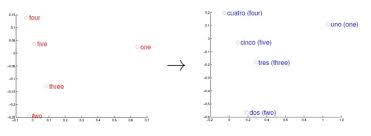

#### Word2vec

Word2vec的思想就是将词映射成一个向量，不同于传统的N-gram模型，word2vec会将同样意义的词映射成近距离的向量。

从上图中可以看到不同语言的词语能映射到相似的向量。

Word2Vec有两种训练模型CBOW(Continue of Back of words)和Skip-Gram。他们的训练过程如下：

假如我们的词组$w_i, w_2, ... w_{n-1}$之后应该出现$w_n$，例如对于句子"今天天气不错，我要去打"，在我们的语境中我们最希望出现"篮球"这个词。那么我们的$w_n$就是"篮球"。

我们定义$context(w) = (w_1, w_2, ..., w_{n-1})$，CBOW就是然后最大化$p(w|context(w))$，用context(w)去预测w。而Skip-Gram就是最大化概率$p(context(w)|w)$，用w去预测context(w)。

### 神经网络

最直观的就是通过神经网络去训练这个模型。

在word2vec出现之前，已经有用神经网络DNN来用训练词向量进而处理词与词之间的关系了。采用的方法一般是一个三层的神经网络结构（当然也可以多层），分为输入层，隐藏层和输出层(softmax层)。

这个模型是如何定义数据的输入和输出呢？一般分为CBOW(Continuous Bag-of-Words 与Skip-Gram两种模型。

CBOW模型的训练输入是某一个特征词的上下文相关的词对应的词向量，而输出就是这特定的一个词的词向量。比如下面这段话，我们的上下文大小取值为4，特定的这个词是"Learning"，也就是我们需要的输出词向量,上下文对应的词有8个，前后各4个，这8个词是我们模型的输入。由于CBOW使用的是词袋模型，因此这8个词都是平等的，也就是不考虑他们和我们关注的词之间的距离大小，只要在我们上下文之内即可。

这样我们这个CBOW的例子里，我们的输入是8个词向量，输出是所有词的softmax概率（训练的目标是期望训练样本特定词对应的softmax概率最大），对应的CBOW神经网络模型输入层有8个神经元，输出层有词汇表大小个神经元。隐藏层的神经元个数我们可以自己指定。通过DNN的反向传播算法，我们可以求出DNN模型的参数，同时得到所有的词对应的词向量。这样当我们有新的需求，要求出某8个词对应的最可能的输出中心词时，我们可以通过一次DNN前向传播算法并通过softmax激活函数找到概率最大的词对应的神经元即可。

Skip-Gram模型和CBOW的思路是反着来的，即输入是特定的一个词的词向量，而输出是特定词对应的上下文词向量。还是上面的例子，我们的上下文大小取值为4， 特定的这个词"Learning"是我们的输入，而这8个上下文词是我们的输出。

这样我们这个Skip-Gram的例子里，我们的输入是特定词， 输出是softmax概率排前8的8个词，对应的Skip-Gram神经网络模型输入层有1个神经元，输出层有词汇表大小个神经元。隐藏层的神经元个数我们可以自己指定。通过DNN的反向传播算法，我们可以求出DNN模型的参数，同时得到所有的词对应的词向量。这样当我们有新的需求，要求出某1个词对应的最可能的8个上下文词时，我们可以通过一次DNN前向传播算法得到概率大小排前8的softmax概率对应的神经元所对应的词即可。

以上就是神经网络语言模型中如何用CBOW与Skip-Gram来训练模型与得到词向量的大概过程。但是这和word2vec中用CBOW与Skip-Gram来训练模型与得到词向量的过程有很多的不同。

word2vec为什么 不用现成的DNN模型，要继续优化出新方法呢？最主要的问题是DNN模型的这个处理过程非常耗时。我们的词汇表一般在百万级别以上，这意味着我们DNN的输出层需要进行softmax计算各个词的输出概率的的计算量很大。有没有简化一点点的方法呢？

### Hierarchical Softmax

层次化Softmax是通过哈夫曼树来减少神经网络的参数。它的训练过程和DNN类似，包含如下过程：

1. Projection层，首先将$(x_1, x_2, ..., x_{n -1})$取平均值作为Projection层的输入。
2. 哈夫曼树层。这一层类似于DNN的隐层和Softmax层。首先我们需要将我们的词空间建立一颗哈夫曼树，然后对于我们的context(w)，我们需要找到目标w，是的$p(w|context(w))$最大。 

上图中的$n(w_2, 1)$就是从Projection层的输出值。而我们的目标值就是输入$w_2$，我们需要沿着图示所示的路径遍历哈夫曼树。

在哈夫曼树中，我们根据sigmoid函数来确定向左走还是向右走。我们可以假定向左走为1，向右走为0，于是我们的概率值为$p(+) = sigmoid(\theta_i * w_2)$，于是向右走的概率值就是$1 - p(+)$。
$$
p(w|context(w)) = \prod_{i=1}^{3}sigmoid(\theta_i * W)^{y_i}(1 - sigmoid(\theta_i * W)) ^ {1 - y_i}
$$
我们的目标是让$p(w|context(w))$最大，根据最大似然规律的求解方法，然后使用随机梯度下降可以求出w的值。

### Negative Sampling

在讲基于Negative Sampling的word2vec模型前，我们先看看Hierarchical Softmax的的缺点。的确，使用霍夫曼树来代替传统的神经网络，可以提高模型训练的效率。但是如果我们的训练样本里的中心词w是一个很生僻的词，那么就得在霍夫曼树中辛苦的向下走很久了。能不能不用搞这么复杂的一颗霍夫曼树，将模型变的更加简单呢？

Negative Sampling采用二元logistic回归求解模型参数。通过负采样，我们得到了N个负样本，$w_1, w_2, ..., w_N$，加上我们的正样本$$假定对于任意的$w_i$使用如下公式确定其发生概率：
$$
P(w_i|context(W))=sigmoid(W\theta^{w_i})
$$
对于目标$w_0$，我们需要让$p(w_0|context(w))$尽量大，而其他的$p(w_n|context(w))$尽量小。我们令
$$
p(w_i, context(w)) =
\begin{cases} 
1 - sigmoid(W\theta ^ {w _ i}) & w_i \neq w_0 \\
sigmoid(W\theta ^ w_0)
\end{cases}
$$
于是我们期望最大化下式：
$$
\prod_{i = 0}^{N}p(W_i,context(w)) = sigmoid(W\theta^{w_0})\prod_{i=1}^{N}(1 - sigmoid(W\theta^{w_i}))
$$
然后根据最大似然定律，使用梯度下降可以求得W，进而可以求得$w_1, w_2, ..., w_n$。